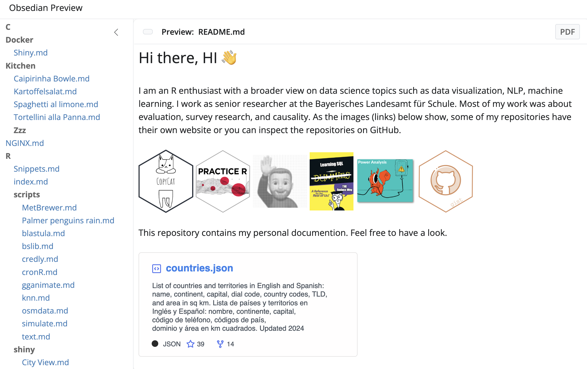

<!-- README.md is generated from README.Rmd. Please edit that file -->

```{r, include = FALSE}
knitr::opts_chunk$set(
  collapse = TRUE,
  comment = "#>",
  fig.path = "man/figures/README-",
  out.width = "100%"
)
```

# robsidian

<!-- badges: start -->

<!-- badges: end -->

The goal of robsidian is to implement a simple interface to Obsidian's API. This package is still in development and not yet on CRAN.

## Installation

You can install the development version of robsidian from [GitHub](https://github.com/) with:

``` r
# install.packages("pak")
pak::pak("edgar-treischl/robsidian")
```

## Example

In order to use the package, you need to set the environment variable `robsidian_dir` to the path of your Obsidian vault. This can be done with the following code:

```{r example}
library(robsidian)
Sys.setenv(robsidian_dir = "~/Documents/GitHub/documentation")
Sys.getenv("robsidian_dir")
```

The package provide the Obsidian preview app as R Studio addin. You can use it to preview the current R Markdown document in Obsidian.



The addin runs:

```{r, eval = FALSE}
robsidian::obsidian_addin()
```
